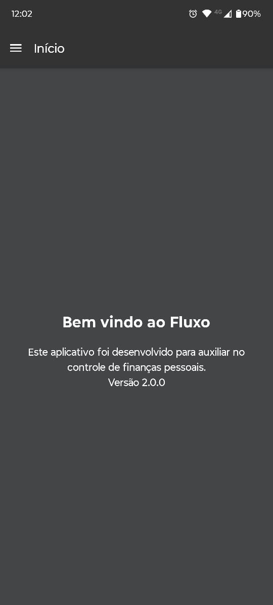
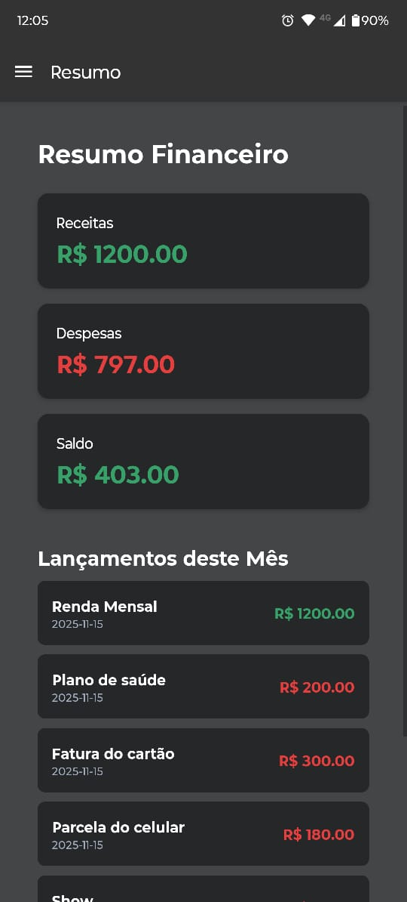
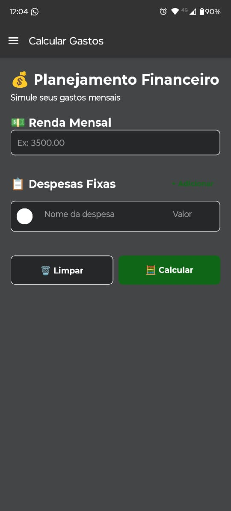
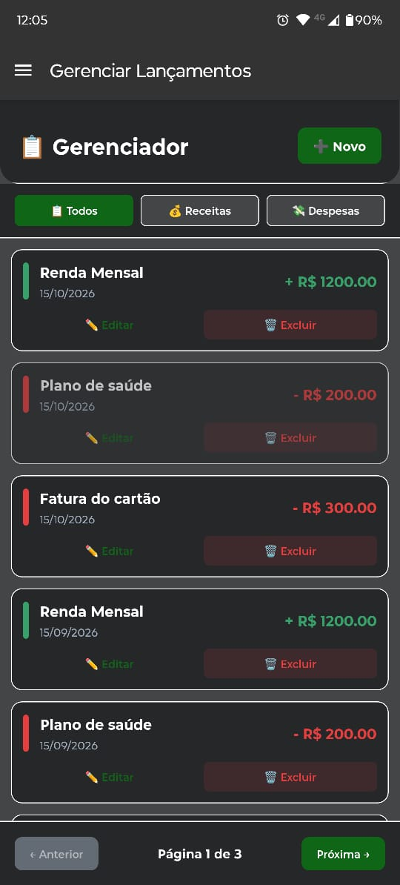

# 💰 Fluxo - Aplicativo de Controle Financeiro

<div align="center">
  
  
  [](https://reactnative.dev/)
  [](https://expo.dev/)
  [](LICENSE)
  [](package.json)
</div>

## 📋 Sobre o Projeto

**Fluxo** é um aplicativo mobile multiplataforma desenvolvido para auxiliar no controle de finanças pessoais de forma simples e intuitiva. Com ele, você pode registrar receitas e despesas, simular gastos mensais, visualizar relatórios detalhados e gerenciar seus lançamentos financeiros.

### ✨ Principais Funcionalidades

- 📊 **Planejamento Financeiro**: Simule seus gastos mensais e veja o impacto no seu orçamento
- 💵 **Gestão de Lançamentos**: Adicione, edite e exclua receitas e despesas
- 📈 **Relatórios Detalhados**: Visualize análises completas com gráficos e indicadores
- 🔄 **Lançamentos Recorrentes**: Configure receitas ou despesas que se repetem mensalmente
- 📅 **Filtros Personalizados**: Filtre por período, tipo e visualize históricos
- 🗑️ **Exclusão em Massa**: Selecione e delete múltiplos lançamentos de uma vez
- 💾 **Armazenamento Local**: Todos os dados são salvos localmente com SQLite

---

## 🚀 Tecnologias Utilizadas

- **[React Native](https://reactnative.dev/)** (v0.81.5) - Framework para desenvolvimento mobile
- **[Expo](https://expo.dev/)** (~54.0.22) - Plataforma para desenvolvimento React Native
- **[React Navigation](https://reactnavigation.org/)** (v7.x) - Navegação entre telas
- **[Expo SQLite](https://docs.expo.dev/versions/latest/sdk/sqlite/)** (~16.0.9) - Banco de dados local
- **[React Native Dropdown Picker](https://github.com/hossein-zare/react-native-dropdown-picker)** - Componente de dropdown

---

## 📱 Estrutura do Projeto

```
App-Financeiro/
├── src/
│   ├── navigation/           # Configuração de navegação
│   │   └── AppNavigator.js
│   ├── repository/           # Camada de acesso ao banco de dados
│   │   └── Database.js
│   ├── screens/              # Telas do aplicativo
│   │   ├── Gastos/
│   │   │   ├── CalculoGastosScreen.js   # Simulador de gastos
│   │   │   └── gastosStyle.js
│   │   ├── Gerenciar/
│   │   │   ├── GerenciarScreen.js       # CRUD de lançamentos
│   │   │   └── gerenciarStyle.js
│   │   ├── Home/
│   │   │   ├── HomeScreen.js            # Tela inicial
│   │   │   └── homeStyle.js
│   │   ├── Relatório/
│   │   │   ├── RelatorioScreen.js       # Relatórios financeiros
│   │   │   └── relatorioStyle.js
│   │   └── Resumo/
│   │       ├── ResumoScreen.js          # Resumo mensal
│   │       └── resumoStyle.js
│   └── theme/
│       └── Theme.js          # Tema e cores globais
├── assets/                   # Imagens e ícones
├── App.js                    # Componente raiz
├── index.js                  # Entry point
├── app.json                  # Configurações do Expo
├── eas.json                  # Configurações do EAS Build
└── package.json              # Dependências do projeto
```

---

## 🎯 Funcionalidades Detalhadas

### 1. 💰 Planejamento Financeiro (Calcular Gastos)
- Insira sua renda mensal
- Adicione múltiplas despesas fixas
- Visualize o saldo restante e o percentual de comprometimento da renda
- Salve lançamentos recorrentes (mensalmente ou por X meses)
- Indicadores visuais de status financeiro (Excelente, Atenção, Risco)

### 2. 📋 Gerenciador
- Visualize todos os seus lançamentos em lista paginada (15 por página)
- Filtre por tipo: Todos, Receitas ou Despesas
- Adicione novos lançamentos com data customizável
- Edite lançamentos existentes
- Delete um ou múltiplos lançamentos de uma vez
- Modo de seleção múltipla para exclusão em massa

### 3. 📊 Relatório
- Visualize relatórios do mês atual ou personalizados (ano/mês)
- Cards com totais de Receitas, Despesas e Saldo
- Análise de comprometimento da renda com barra de progresso
- Status visual com cores (Excelente, Atenção, Risco, Crítico)
- Lista completa de todos os lançamentos do período

### 4. 📈 Resumo
- Visão rápida do mês atual
- Totais de Receitas, Despesas e Saldo
- Lista dos lançamentos recentes
- Acesso rápido ao relatório completo

---

## 🛠️ Instalação e Configuração

### Pré-requisitos

- **Node.js** (v14 ou superior)
- **npm** ou **yarn**
- **Expo CLI** (instalado globalmente)
- **EAS CLI** (para builds de produção)

### Passo a Passo

1. **Clone o repositório**
```bash
git clone https://github.com/seu-usuario/App-Financeiro.git
cd App-Financeiro
```

2. **Instale as dependências**
```bash
npm install
# ou
yarn install
```

3. **Inicie o servidor de desenvolvimento**
```bash
npx expo start
# ou
npm start
```

4. **Execute no dispositivo**
- Escaneie o QR Code com o **Expo Go** (Android/iOS)
- Ou pressione `a` para abrir no emulador Android
- Ou pressione `i` para abrir no simulador iOS

---

## 📦 Build para Produção

### Gerar APK (Android)

```bash
# Login no EAS
eas login

# Build de produção
eas build --platform android --profile production

# Build de preview (APK)
eas build --platform android --profile preview
```

### Configuração do EAS Build

O arquivo `eas.json` já está configurado com os perfis:
- **development**: Build de desenvolvimento com cliente de desenvolvimento
- **preview**: Build de preview (APK para testes)
- **production**: Build de produção otimizado

---

## 🎨 Temas e Cores

O aplicativo utiliza um tema personalizado definido em `src/theme/Theme.js`:

```javascript
colors: {
  primary: '#3B82F6',      // Azul principal
  success: '#38A169',      // Verde (receitas)
  error: '#E53E3E',        // Vermelho (despesas)
  warning: '#F59E0B',      // Amarelo (atenção)
  background: '#F9FAFB',   // Fundo claro
  surface: '#FFFFFF',      // Superfície de cards
  text: '#1F2937',         // Texto principal
}
```

---

## 🗄️ Banco de Dados

O aplicativo utiliza **SQLite** para armazenamento local. A estrutura da tabela:

### Tabela: `lancamentos`

| Campo           | Tipo    | Descrição                           |
|-----------------|---------|-------------------------------------|
| id              | INTEGER | Chave primária (autoincremento)     |
| nome            | TEXT    | Descrição do lançamento             |
| valor           | REAL    | Valor em reais                      |
| tipo            | TEXT    | 'receita' ou 'despesa'              |
| data            | TEXT    | Data no formato YYYY-MM-DD          |
| repete          | INTEGER | 0 ou 1 (indica se repete)           |
| repete_sempre   | INTEGER | 0 ou 1 (repete indefinidamente)     |
| repete_meses    | INTEGER | Quantidade de meses de repetição    |

---

## 🤝 Contribuindo

Contribuições são bem-vindas! Siga os passos:

1. Faça um Fork do projeto
2. Crie uma branch para sua feature (`git checkout -b feature/MinhaFeature`)
3. Commit suas mudanças (`git commit -m 'Adiciona MinhaFeature'`)
4. Push para a branch (`git push origin feature/MinhaFeature`)
5. Abra um Pull Request

---

## 📄 Licença

Este projeto está sob a licença MIT. Veja o arquivo [LICENSE](LICENSE) para mais detalhes.

---

## 👨‍💻 Autores

**Gabriel Xavier**
- GitHub: [@GabrielXavierOliveira](https://github.com/GabrielXavierOliveira)
- Expo: [@gabriel_xavier](https://expo.dev/@gabriel_xavier)

**Murilo Furtado**
- GitHub: [@D0UGH5](https://github.com/D0UGH5)
- Expo: [@murilo_furtado1](https://expo.dev/@murilo_furtado1)

---

## 📸 Screenshots

### Tela Inicial


### Resumo


### Cálculo de Gastos


### Relatório


### Gerenciar Lançamentos


---

## 🔮 Roadmap

- [ ] Exportação de dados (CSV/PDF)
- [ ] Gráficos interativos
- [ ] Categorias personalizadas
- [ ] Backup em nuvem
- [ ] Modo escuro
- [ ] Multi-idiomas (i18n)
- [ ] Notificações de lembretes
- [ ] Análise de tendências

---

## 📞 Suporte

Encontrou um bug ou tem uma sugestão? Abra uma [issue](https://github.com/seu-usuario/App-Financeiro/issues) no GitHub!

---

<div align="center">
  <p>Desenvolvido com ❤️ usando React Native e Expo</p>
  <p>© 2025 Fluxo - Todos os direitos reservados</p>
</div>
